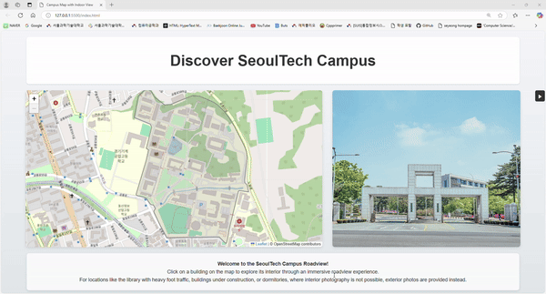

# SeoulTech Campus Map and Indoor Viewer

## 🚀 Introduction
**SeoulTech Campus Map and Indoor Viewer**is a web application that allows users to explore the campus and building interiors of Seoul National University of Science and Technology (SeoulTech).
It is designed to enhance the exploration experience for students and visitors, with the following objectives:

## 🎯 Project Purpose
This project aims to address the following two challenges:

1. **Building Navigation Challenges for SeoulTech Students**  
   - Most students only use the buildings related to their department, which limits opportunities to explore other buildings.  
   - There are many study spaces available within buildings, but students are often unaware of them.
   - This system helps students explore building interiors and discover new study spaces.


2. **Building Navigation Challenges for Prospective Students**  
   - Prospective students visiting the university for interviews or essay exams often enter university buildings for the first time.
   - By allowing them to check the interior locations of the buildings where their interviews or exams are scheduled, this system aims to reduce confusion and help them prepare efficiently.


## 🌐 Live Demo
[SeoulTech Campus Map and Indoor Viewer](https://se-zero.github.io/seyeong/)  
Click the link above to directly experience the project!

## 🎥 Demo Video



## 💡 Features
- **Campus Map Navigation**: Visually check major buildings and their boundaries.
- **Indoor Roadview**: Explore each floor virtually using `Pannellum.js`.
- **Sidebar Interaction**: Access detailed floor information and indoor views for selected buildings.
- **Detailed Building Information**: Provides purposes, departments, and additional details about each building.

## 🛠️ Technology Stack
- **Frontend**:
  - HTML5, CSS3, JavaScript (ES6+)
  - `Leaflet.js`: Map visualization
  - `Pannellum.js`: Roadview viewer
- **Backend**:
  - None (Static web application)
- **Deployment**:
  - GitHub Pages

## 📂 Project Structure
```plaintext
seyeong/
├── README.md                 # Root directory README file
├── index.html
├── style.css
├── mapLayers.js
├── roadview.js
├── sidebar.js
├── buildingController.js
├── buildingDescriptions.js
├── Eoui_Hall/
├── Mirae_Hall/
├── Hi_Tech_Hall/
└── ...  
```


## 🔧 Setup & Usage
### 1. Clone the Repository
Clone the project to your local machine:
```bash
git clone https://github.com/se-zero/seyeong.git
cd seyeong
```
### 2. Open the Project in a Browser
Open the `index.html` file in your browser:
```bash
open index.html
```
(For Windows users, use the command start index.html instead.)
### 3. Explore the Map!
- Click on a building.
- Use the sidebar to explore information for each floor.

## 📄 License
This project is licensed under the **MIT License**. For more details, refer to the [LICENSE](LICENSE) file.

## 📖 References
- [Leaflet.js](https://leafletjs.com)
- [Pannellum.js](https://pannellum.org)
- This project incorporates references and code from open-source libraries, which are cited above.


